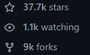
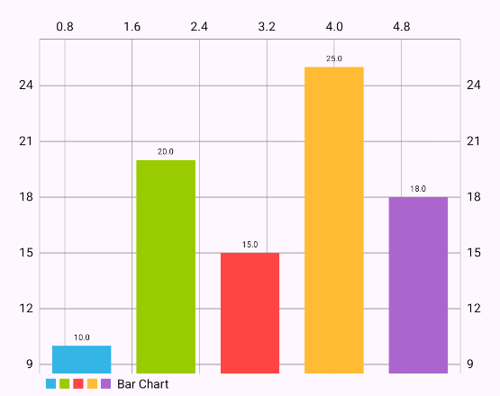
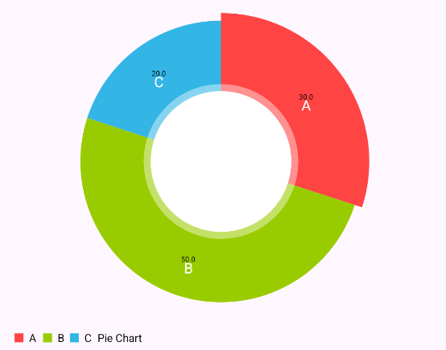
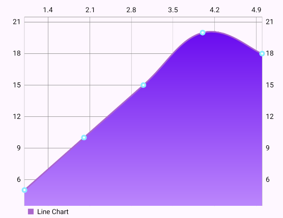
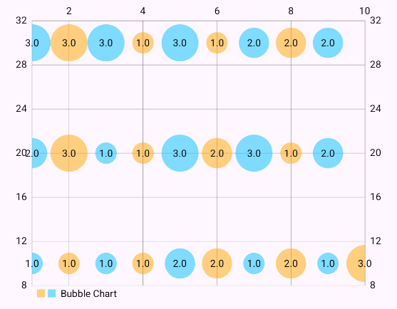
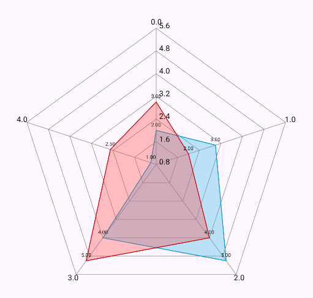

# 📊 MPAndroidChart

---

## ❓ Zakaj MPAndroidChart?

**MPAndroidChart** je odlična izbira za razvijalce, ki želijo:  
- Ustvariti interaktivne in prilagodljive grafe.  
- Hitro integrirati grafe v svoje Android aplikacije.  
- Povečati vizualno privlačnost svojih aplikacij.  
- **MPAndroidChart je različica iste knjižnice, ki je na voljo tudi za iOS pod imenom [Charts](https://github.com/ChartsOrg/Charts).**

---

## ✔️ Prednosti

-  **Enostavna uporaba:** Intuitiven API za integracijo.  
-  **Raznolikost grafikonov:** Podpora za LineChart, BarChart(horizontal/vertical), PieChart, ScatterChart, RadarChart in druge.  
-  **Interaktivnost:** Podpira povečavo, premikanje in klikanje na točke in prikaz podatkov ob prehodu (hover).  
-  **Prilagodljivost:** Možnost spreminjanja barve, velikosti, smeri in kombiniranja več vrst grafov.  
-  **Dobra dokumentacija:** Na voljo so primeri in vodniki v samem repozitoriju ter na spletu. 
-  **Široka podpora:** Deluje na vseh napravah z Android API 14+, ki vključujejo več kot 99% današnjih uporabnikov.


## ❌ Slabosti

-  **Zmogljivost:** Pri velikih količinah podatkov lahko opazimo nižjo odzivnost.  
-  **Zastarelost:** V zadnjih letih je bilo manj posodobitev, kar lahko privede do težav pri delovanju na novejših napravah.  
-  **Odvisnost od skupnosti:** Brez uradnega vzdrževanja s strani večje organizacije.  


---

## 👥 Število uporabnikov

MPAndroidChart uporablja na tisoče razvijalcev in je ena izmed najbolj priljubljenih knjižnic za grafe v Android ekosistemu.  



## 🔧 Vzdrževanje projekta

-  **Zadnja posodobitev:** Knjižnica je bila nazadnje posodobljena [septembra 2020](https://github.com/PhilJay/MPAndroidChart).  
-  **Število razvijalcev:** Android različico projekta trenutno vzdržuje 68 članov, medtem ko iOS različico vzdržuje 154 članov.  

---

## 🛡️ Licenca

**MPAndroidChart** je licencirana pod **Apache 2.0** licenco.

Več informacij najdete [tukaj](https://www.apache.org/licenses/LICENSE-2.0).  

---

## 📸 Primeri z implementacijo

### 1. Bar Chart


```kotlin
private fun setupBarChart() {
    val entries = listOf(
        BarEntry(1f, 10f),
        BarEntry(2f, 20f),
        BarEntry(3f, 15f),
        BarEntry(4f, 25f),
        BarEntry(5f, 18f)
    )

    val dataSet = BarDataSet(entries, "Bar Chart").apply {
        colors = listOf(
            resources.getColor(android.R.color.holo_blue_light, theme),
            resources.getColor(android.R.color.holo_green_light, theme),
            resources.getColor(android.R.color.holo_red_light, theme),
            resources.getColor(android.R.color.holo_orange_light, theme),
            resources.getColor(android.R.color.holo_purple, theme)
        )
    }

    val barData = BarData(dataSet).apply {
        barWidth = 0.7f
    }

    binding.barChart.apply {
        data = barData
        description.isEnabled = false
        animateY(1000)
    }
}
```

### 2. Pie Chart


```kotlin
private fun setupPieChart() {
    val entries = listOf(
        PieEntry(30f, "A"),
        PieEntry(50f, "B"),
        PieEntry(20f, "C")
    )

    val dataSet = PieDataSet(entries, "Pie Chart")
    dataSet.colors = listOf(
        resources.getColor(android.R.color.holo_red_light, theme),
        resources.getColor(android.R.color.holo_green_light, theme),
        resources.getColor(android.R.color.holo_blue_light, theme)
    )

    binding.pieChart.data = PieData(dataSet)
    binding.pieChart.description.isEnabled = false
    binding.pieChart.animateY(1000)
}
```

### 3. Line Chart (Gradient fill)


```kotlin
private fun setupLineChart() {
    val entries = listOf(
        Entry(1f, 5f),
        Entry(2f, 10f),
        Entry(3f, 15f),
        Entry(4f, 20f),
        Entry(5f, 18f)
    )

    val dataSet = LineDataSet(entries, "Line Chart").apply {
        color = resources.getColor(android.R.color.holo_purple, theme)
        lineWidth = 2f
        circleRadius = 4f
        setDrawCircles(true)
        setDrawValues(false)
        mode = LineDataSet.Mode.CUBIC_BEZIER
        setDrawFilled(true)
        fillDrawable = resources.getDrawable(R.drawable.gradient_line_fill, theme)
    }

    val lineData = LineData(dataSet)

    binding.lineChart.apply {
        data = lineData
        description.isEnabled = false
        animateX(1000)
    }
}
```

### 4. Bubble Chart


```kotlin
private fun setupBubbleChart() {
    val entries = mutableListOf<BubbleEntry>()

    for (x in 1..10) {
        entries.add(BubbleEntry(x.toFloat(), 10f, (1..3).random().toFloat()))
        entries.add(BubbleEntry(x.toFloat(), 20f, (1..3).random().toFloat()))
        entries.add(BubbleEntry(x.toFloat(), 30f, (1..3).random().toFloat()))
    }

    val dataSet = BubbleDataSet(entries, "Bubble Chart").apply {
        setColors(
            android.graphics.Color.argb(128, 255, 165, 0),
            android.graphics.Color.argb(128, 0, 191, 255)
        )
        valueTextSize = 10f
    }

    val bubbleData = BubbleData(dataSet)

    binding.bubbleChart.apply {
        data = bubbleData
        description.isEnabled = false
        animateY(1000)
        setTouchEnabled(true)
        setScaleEnabled(false)
    }
}
```

### 5. Radar Chart


```kotlin
private fun setupRadarChart() {
    val entries1 = listOf(
        RadarEntry(2f),
        RadarEntry(3f),
        RadarEntry(5f),
        RadarEntry(4f),
        RadarEntry(1f)
    )

    val entries2 = listOf(
        RadarEntry(3f),
        RadarEntry(2f),
        RadarEntry(4f),
        RadarEntry(5f),
        RadarEntry(2.5f)
    )

    val dataSet1 = RadarDataSet(entries1, "Data Set 1").apply {
        color = resources.getColor(android.R.color.holo_blue_dark, theme)
        fillColor = resources.getColor(android.R.color.holo_blue_light, theme)
        setDrawFilled(true)
    }

    val dataSet2 = RadarDataSet(entries2, "Data Set 2").apply {
        color = resources.getColor(android.R.color.holo_red_dark, theme)
        fillColor = resources.getColor(android.R.color.holo_red_light, theme)
        setDrawFilled(true)
    }

    val radarData = RadarData(dataSet1, dataSet2)

    binding.radarChart.apply {
        data = radarData
        description.isEnabled = false
        animateXY(1000, 1000)
    }
}
```